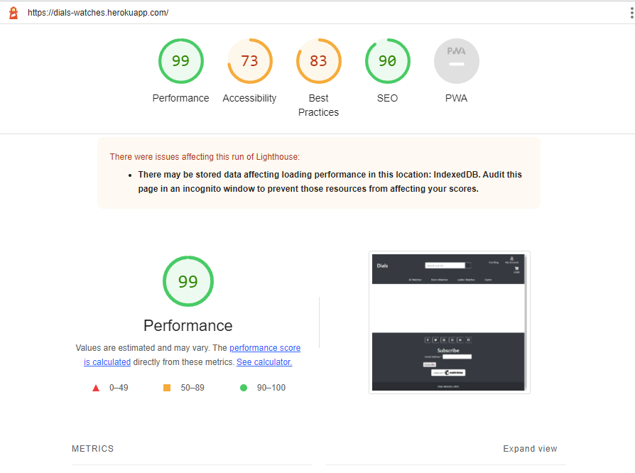

# Dials - Wrist Watch Store

# Overview

### About
* Dials is and fictional ecommerce store that sells a variety of wrist watches for men and women. Built as a Final Full Stack Project.

* The live deployed application can be found here [Dials](https://dials-watches.herokuapp.com/)

# User Experience

## Project goals

* Goal of the project was to show my competency in being able to develop complex full stack application. 
* The users of the site will be able to register and login on the page if they whish to do so. Registration is not needed
to make the purchases, but they can sign up for the newsletter and check out the blog page.

## Agile

## Strategy

* Goals
    * Site Owner Goals
        * to be able to sell the products on the site
        * to be able to display products on the site easily
        * to be able to add, edit, delete all the products
        * to interact with buyers through the newsletter and facebook page
        * to easily navigate the website
        * to be able to modify the content through the owner profile page

    * Customer Goals
        * to easily find the product of interest on the site
        * to be able to navigate the website on any page
        * to be able the add the products to the bag
        * to be able to checkout securely
        * to be able to sign up for the newsletter and check blog for the news

## User Stories

# Features

* The first release includes:
    - A main page where customers can immediately open one of the basic categories
    - They can sign up for the newsletter and check blogs
    - Users can register and login, modify their information and reset the password
    - They are able to add items to the bag and checkout securely using Stripe
    - can purchase items as anonymous
    - users can log out at any time.

* Future features
    * will include the full review option for the products (currently only model and template present)
    * commenting on the blog posts and liking the items

# Features with manual testing

### Login page

* User can open the webpage from the URL provided and will be asked to log in. If they dont have an account there is a "Sign Up" link which will lead them to register page.
8 Tested and it work without any issues

### Register page

* If user doesn't have sign in details already they can register here
* feature has been tested and it's sending the verification emails accordingly

### E-mail verification

* E-mail verification page is displaying message correctly.
* Tested, emails are being sent though the message will need to be updated

### Products

* List of products, can be sorted with filters
* Tested manually, product are benig displayed preperly by price etc.

### Product Detail

* Product detail page shows all the info about the item, allows users to more all at one and proceed to checkout
* Items are being added properly and the notification shown that the item has been added

### Checkout

* The site user can view all their items and checkout securely
* feature has been tested and test payments are going through and order summary displaying

### Blog

* currently simple blog page where customers can see some upcoming products

## Bussiness Model

* This would be a medium sized online store that is operating on B2C bases. Its easy to use,
  shoppers can immediately select items without logging in and checkout. Intention is to offer
  lots of different models of products, offer good deals and also information about upcoming products.

## Marketing

Added facebook bussiness page

## Database model and wireframe

* The Database diagram
[here](readme_img/database.png)

* Wireframes

[Wireframe products](readme_img/wireframe-1.png)
[Wireframe product details](readme_img/wireframe-2.png)

# Technology-Used-In-Design

* Django framework
* HTML5
* CSS3
* Python
    - Used in conjunction with the Django framework to implement the website.
* Heroku
    - Use to deploy the project on to the live site.

* [Django](https://docs.djangoproject.com/en/4.0/)
    - Used to create the URLS, Views, Forms and models in the site.
* [Bootstrap](https://getbootstrap.com/)
    - Bootstrap is mainly used to style the page and add responsiveness to the website.
* [AWS](https://cloudinary.com/)
    - AWS is used to store the static files.
* [Google Fonts](https://fonts.google.com/)
    - Main Fonts for the project
* [Gitpod](https://www.gitpod.io)
    - Gitpod is used to write the code
* [Github](https://github.com/)
    - Github is being used to store the repository.
* [Font Awesome](https://fontawesome.com/)
    - Font awesome is used for the info, update, delete icons.
* [PostGres](https://www.postgresql.org/download/)
    - Database used through heroku.
* [SQLite](https://django-allauth.readthedocs.io/en/latest/)
    - https://www.sqlite.com/index.html
* [All Auth](https://django-allauth.readthedocs.io/en/latest/)
    - All Auth used for authentication od website.
* [Stripe](https://stripe.com/ie)
    - To make dummy transaction with dummy credit card.
* [Pillow](https://python-pillow.org/)
    - Python imaging library   

## Requirements file

asgiref==3.5.2
boto3==1.24.68
botocore==1.27.68
dj-database-url==0.5.0
Django==3.2.15
django-allauth==0.41.0
django-countries==7.2.1
django-crispy-forms==1.14.0
django-storages==1.13.1
gunicorn==20.1.0
jmespath==1.0.1
oauthlib==3.2.0
Pillow==9.2.0
psycopg2==2.9.3
psycopg2-binary==2.9.3
python3-openid==3.2.0
pytz==2022.2.1
requests-oauthlib==1.3.1
s3transfer==0.6.0
sqlparse==0.4.2
stripe==4.1.0

### HTML Validator

### CSS-Validator

## PEP8 Validation

### Views.py

### Lighthouse Scores

# Deployment

### Gitpod and GitHub

Used the [Code Institute Full Template](https://github.com/Code-Institute-Org/gitpod-full-template) to set up the gitpod workspace.

### Steps:

* Click create new repository.
* Give the repository a name.
* Under Repository template pick the [Code Institute Full Template](https://github.com/Code-Institute-Org/gitpod-full-template).
* Click create repository
- Use GIT ADD .
- GIT COMMIT -m "Comments"
- GIT PUSH
- To commit the code and push to Github

## Forking the Github Repository

- Locate the desired Github repository.
- In the top right corner click the Fork button.
- The repository has been forked and you can now work on the copy.

## Cloning a Github repository

- Locate the desired Github repository.
- Use the code button and copy the link.
- Open Gitpod and select your directory where you want the clone to be created.
- Type git clone in the terminal and paste the link in.
- The clone will be created

### Creating and Deploying Application with Heroku

I used the "I Think Therefore I Blog" tutorial provided by The Code Institute to deploy the application on Heroku.

- Log in to Heroku [Heroku](https://dashboard.heroku.com/)
- Click New 
- Give the app a name and choose the region
- Click on settings first and set the Reveal Config Vars
- Click Deploy at the top to go to the Deployment settings
- Choose GiHub as the deployment method
- Search for your app and connect
- Use Automatic deploys if you would like a new build when changes are pushed to GitHub from Gitpod
- Use Manual deploy for a new build every time this button is clicked.
- Once completed click View App

# Credits
- Boutique Ado tutorial from Code Institute for everything, it would be almost impossible without it
- https://ccbv.co.uk/projects/Django/4.0/ for views
- https://docs.djangoproject.com/en/4.0/ always handy django documentation
- https://mdbootstrap.com/docs/
- Slack community (got a bit of direction how to fix static files not being recognized by Heroku)
- https://www.ablogtowatch.com/ for nice text to add to a blog app
- StackOwerflow

# Issues/Bugs

### Static files were not loading when deployed on Heroku multiple time

Fix:
* Installed correct versions of apps and updated requirements.txt files

### Small bugs with positioning of the pages
* it's due to project not having enough styling at the moment